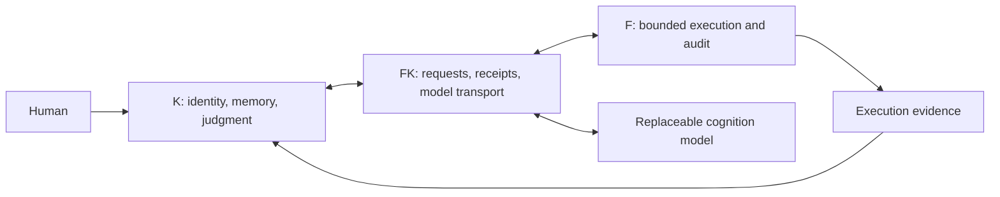

# K — Persistent identity. Replaceable models. Verifiable execution.

**An experimental open-source framework for long-lived personal agents.**

K explores how an agent can keep its identity and history as its model changes,
revise beliefs without erasing the past, and turn decisions into bounded actions
with inspectable evidence. The entire source is available under the MIT License.

[简体中文](README.zh-CN.md) · [First run](docs/FIRST_RUN.md) · [Architecture](docs/ARCHITECTURE.md) · [Contribute](CONTRIBUTING.md)

## Three roles, explicit boundaries



| Layer | Responsibility |
|---|---|
| **K** | Identity, beliefs, personality, skills, dialogue, and decisions |
| **F** | Mechanical request validation, bounded execution, audit, and supervision |
| **FK** | Role boundaries, communication, model-provider traffic, and receipts |

Model output enters the system as an untrusted candidate. Requests and receipts
have explicit schemas. Historical records remain available when current beliefs
are revised.

## Explore the code

- **Continuity across model changes:** identity/model separation and continuity regression tests.
- **Evidence-linked memory:** conversation audit, append-only revisions, and bounded recall.
- **Bounded action:** fixed allowlists, strict proposal parsing, and execution-receipt verification.
- **Visible answer origins:** model proposals, retries, and programmatic policy fallbacks are distinguished in audit records.
- **Reproducible engineering checks:** synthetic fixtures, private mount namespaces, real local audit IPC, and restart/recall integration tests.

## Start with an offline run

Use Linux, Python 3.13, pytest 8.3.5, bash, and util-linux. The isolated source gate
requires root privileges for its private mount namespace.

```bash
git clone https://github.com/zkkz0044-dot/K.git
cd K
python3 scripts/check_public_tree.py
python3 scripts/verify_sha256.py
sudo env "PATH=$PATH" bash scripts/test_clean_install.sh
```

No API key or paid inference is needed for these tests. They stage disposable
runtime fixtures and do not install or start persistent systemd services.
See [the first-run guide](docs/FIRST_RUN.md) for requirements and failure handling.

The pre-publication Linux source gate passed **1208 tests**:

| K | F | FK | Public interfaces and offline integration |
|---:|---:|---:|---:|
| 504 | 530 | 161 | 13 |

These are engineering regression checks. Cognitive quality needs independent,
unseen-task evaluation with model answers and policy fallbacks scored separately.

## Current scope

This is an early experimental framework. The bundled model-provider implementation
uses OpenAI. Source access is free; external inference may incur provider charges.
Full first-run systemd deployment and real-provider connectivity need separate
runtime acceptance. The panel is intended for loopback access on a trusted machine.
Some dialogue rubrics use language heuristics, and policy fallbacks are explicitly
marked. Read [capabilities and limitations](docs/CAPABILITIES_AND_LIMITATIONS.md)
before evaluating or deploying this snapshot.

## Build with us

We welcome small, reproducible experiments and focused improvements:

- Local model providers behind the existing gateway.
- Clean first-run deployment in a disposable VM.
- Independent holdout evaluation and failure analysis.
- Cross-model continuity experiments.
- Long-document recall with measured coverage.

See [the roadmap](docs/ROADMAP.md) and [contribution guide](CONTRIBUTING.md).
Open an issue with your environment, minimal reproduction, observed behavior,
and the evidence you would use to judge success. Keep personal history, credentials,
and private infrastructure out of reports. If this direction interests you,
star or fork the project and bring an experiment.

## Repository map

```text
K/              identity, memory, cognition, dialogue, world reasoning
F/              execution, evidence, audit, runtime supervision
FK/             role boundaries, IPC, model-provider runtime
PANEL-v0.1/     local status and chat panel
docs/           architecture, experiments, security, and development
scripts/        source validation and release checks
```

## License

[MIT License](LICENSE). All bundled source is available; there is no paid edition
or withheld runtime module. See [Security](SECURITY.md) for reporting guidance.
