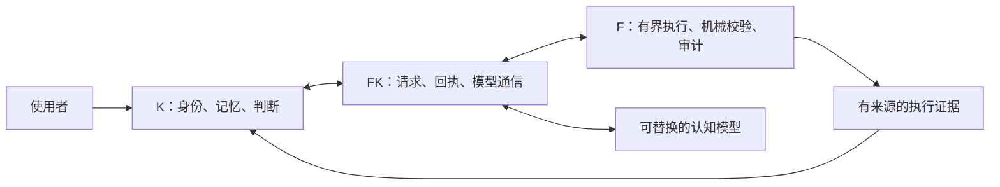

# K：持续身份，可替换模型，可核验执行

**一个探索长期个人智能体的开源实验框架。全部源码开放，MIT 许可证。**

K 把身份、记忆、判断和执行之间的关系写成可检查的代码契约。
我们想探索：模型更换以后，智能体怎样保留自己的历史；发生错误以后，怎样更新判断并留下证据；需要行动时，怎样把认知与执行权限清楚地分开。

[English](README.md) · [首次运行](docs/FIRST_RUN.md) · [架构](docs/ARCHITECTURE.md) · [能力边界](docs/CAPABILITIES_AND_LIMITATIONS.md)

## 三个角色，一条有证据的链路



- **K** 保管身份、信念、人格、技能状态和对话判断。
- **F** 校验有界请求、执行预先允许的操作、保管审计证据。
- **FK** 承担角色边界、通信和回执传输。

## 值得研究的部分

| 关注点 | 代码中的实现 |
|---|---|
| 模型更换后的连续性 | 身份与模型分离的配置、校验及连续性回归测试 |
| 可修正的记忆 | 保留历史记录，单独追加当前信念及其证据关联 |
| 可核验的行动 | 动作白名单、严格输入协议、执行回执与拒绝原因 |
| 可观察的回答来源 | 区分模型候选、重试和程序规则兜底 |
| 可复现的工程检查 | 私有挂载命名空间、合成运行数据、离线集成测试 |

## 先跑起来：离线工程验收

使用 Linux、Python 3.13 和 pytest 8.3.5。隔离测试需要 root 权限和 util-linux。

```bash
git clone https://github.com/zkkz0044-dot/K.git
cd K
python3 scripts/check_public_tree.py
python3 scripts/verify_sha256.py
sudo bash scripts/test_clean_install.sh
```

测试不需要 API 密钥，也不调用付费模型。首次运行细节见 [FIRST_RUN](docs/FIRST_RUN.md)。

发布前实际验证：**K 504 项、F 530 项、FK 161 项、公开接口与离线集成 13 项，共 1208 项通过。**
这些结果证明相应工程契约的回归行为，认知质量仍需独立的未知问题评估。

## 当前版本的边界

这是早期实验性框架。当前模型接入实现为 OpenAI；源码免费，实际外部推理可能产生服务商费用。
完整 systemd 首次部署和真实模型连接仍需单独验收。面板供受信任机器本机使用。
部分语言校验使用启发式规则；规则兜底会明确标注来源，不能计作模型推理成功。
详见 [能力与限制](docs/CAPABILITIES_AND_LIMITATIONS.md)。

## 一起推进

欢迎提交具体问题、复现实验和小范围改进。优先方向：本地模型接入、干净环境部署、跨模型连续性实验、独立留出集评测和长期记忆召回。

建议在 Issue 中附上环境、最小复现、实际结果和预期行为。不要上传个人记忆、对话、密钥或私人服务器数据。
参见 [路线图](docs/ROADMAP.md) 和 [贡献指南](CONTRIBUTING.md)。喜欢这个方向，可以 Star 或 Fork，带着自己的实验结果一起完善它。

## 许可证

所有随仓库发布的源码使用 [MIT License](LICENSE)。没有收费版或保留模块。
